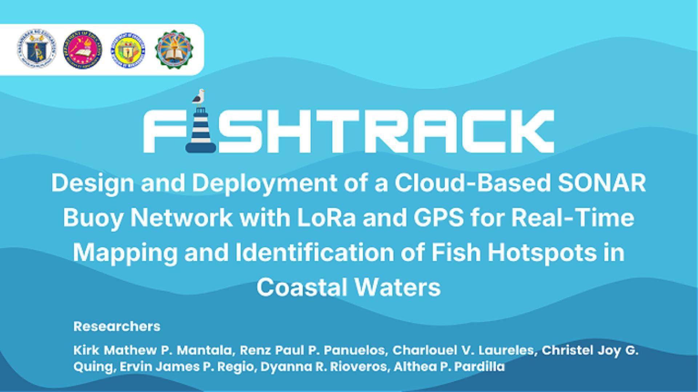
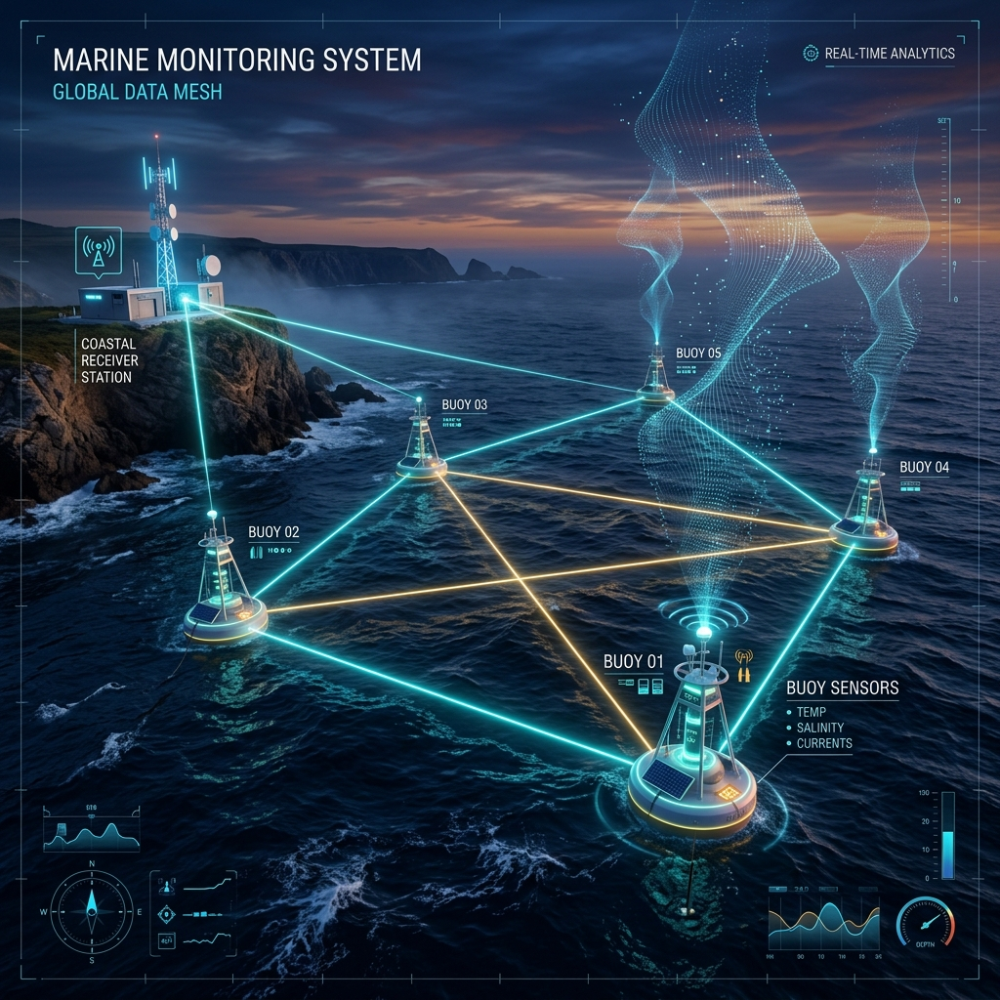
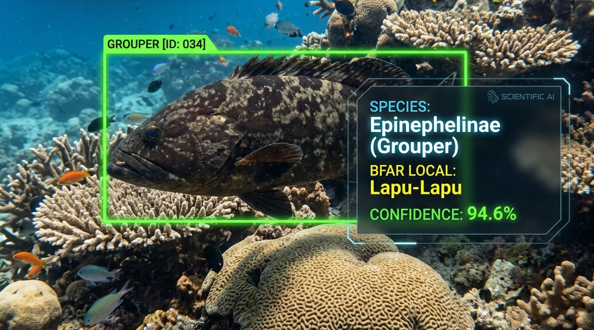
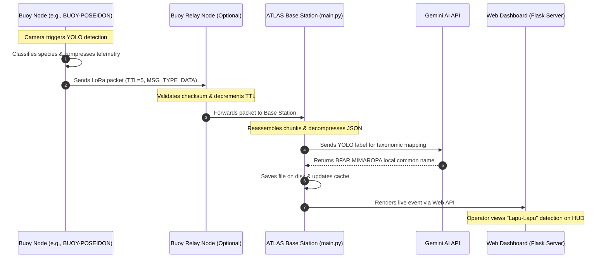

# <p align="center">

<p align="center">
  <strong>Multi-Hop LoRa Mesh Network & AI-Powered Oceanographic Monitoring Control Center</strong>
</p>

<p align="center">
  
  
  
  
  
</p>

---

## 🌊 Project Overview

**FishTrack** is a state-of-the-art research project designed for marine life tracking and oceanographic telemetry monitoring. By leveraging **LoRa Multi-Hop Mesh Networks** and **Edge Computer Vision (YOLO)**, the system enables cost-effective, long-range underwater surveillance and ecological monitoring in coastal zones.

The project is developed in collaboration with research data and taxonomy guidelines from the **Bureau of Fisheries and Aquatic Resources (BFAR) Regional Fisheries Office - MIMAROPA** (Provincial Fishery Office, Boac, Marinduque, Philippines). 

### 📡 Multi-Hop Mesh Topology

Because high-frequency radio waves degrade rapidly over open water and physical obstructions, FishTrack implements a custom multi-hop routing protocol. Edge buoy nodes float on the ocean, capture marine data, and relay messages through each other until they reach the land-based **ATLAS Base Station**.

<p align="center">
  <br>
  <em>Figure 1: Conceptual visualization of the multi-hop LoRa buoy mesh network communicating with the coastal ATLAS Base Station.</em>
</p>

---

## 🚀 Key Features

*   **Self-Healing Ad-Hoc Routing:** Dynamically maintains neighbor tables, handles packet TTLs, deduplicates messages, and supports relayed transmissions.
*   **Edge YOLO Fish Detection:** Smart buoys execute object detection on underwater cameras to classify fish species.
*   **Gemini AI Taxonomical Verification:** Integrates with Gemini AI to map raw YOLO classifications to official **BFAR MIMAROPA** taxonomy and local common names (e.g., mapping *Epinephelinae* to **"Lapu-Lapu"**).
*   **Acoustic Sonar Scanning:** Captures sonar data to detect underwater movements and map seabed profiles.
*   **Reliable Chunked Transmission:** Implements compression (zlib) and chunked packets with custom ACKs to transmit larger data streams (like images or sonar sweeps) over low-bandwidth LoRa.
*   **Real-time Flask Dashboard:** Sleek Web GUI featuring network stats, live telemetry (GPS & Battery), active commands control center, and audit logging.

<p align="center">
  <br>
  <em>Figure 2: Simulated underwater camera feed illustrating the YOLO detection bounding box matched with local BFAR taxonomic labels.</em>
</p>

---

## 📊 System Architecture & Data Flow

Below is the network message flow tracing a detection event from a buoy to the Base Station web dashboard:



---

## 📂 Codebase File Structure

The Base Station system is organized into modular Python files:

| File | Description |
| :--- | :--- |
| [`main.py`](file:///c:/Users/EJ/Desktop/FISHTRACK/MACOSX/BASE_STATION2/main.py) | **System Entry Point.** Starts the main thread loops: LoRa serial listener, Flask web server, scheduler, and network maintenance loop. |
| [`config.py`](file:///c:/Users/EJ/Desktop/FISHTRACK/MACOSX/BASE_STATION2/config.py) | **Central Configuration.** Hardware settings (COM ports, baud rates), message types, directories paths, and command registries. |
| [`hardware.py`](file:///c:/Users/EJ/Desktop/FISHTRACK/MACOSX/BASE_STATION2/hardware.py) | **LoRa Interface.** Manages half-duplex serial connection to the Raspberry Pi Pico + LoRa transceiver, handling TX/RX mode switching. |
| [`logic.py`](file:///c:/Users/EJ/Desktop/FISHTRACK/MACOSX/BASE_STATION2/logic.py) | **Network Logic.** Manages the `NetworkState` class, tracks active buoys, monitors battery logs, routes/forwards packets, and reassembles incoming chunks. |
| [`scheduler.py`](file:///c:/Users/EJ/Desktop/FISHTRACK/MACOSX/BASE_STATION2/scheduler.py) | **Command Dispatcher.** Schedules and queues manual or periodic commands to buoys (e.g., requesting sonar scans), handling retry logic and queues. |
| [`analytics.py`](file:///c:/Users/EJ/Desktop/FISHTRACK/MACOSX/BASE_STATION2/analytics.py) | **Analytics Engine.** Bridges computer vision outputs with the BFAR MIMAROPA database and queries Gemini AI for taxonomical verification. |
| [`server.py`](file:///c:/Users/EJ/Desktop/FISHTRACK/MACOSX/BASE_STATION2/server.py) | **Web Server.** Flask implementation serving API routes, tracking audits, and rendering dashboard templates. |
| [`utils.py`](file:///c:/Users/EJ/Desktop/FISHTRACK/MACOSX/BASE_STATION2/utils.py) | **Utilities.** Support functions for packet zlib compression/decompression, SHA256 checksum validation, and unique message ID generation. |

---

## ⚙️ Installation & Setup

### 1. Prerequisites
*   Python 3.8 or higher installed.
*   A connected LoRa transceiver module (via USB/Serial, e.g., a Raspberry Pi Pico acting as a LoRa controller).

### 2. Install Dependencies
Install the required Python modules:
```bash
pip install flask requests pyserial
```

### 3. Hardware Configuration
Open [`config.py`](file:///c:/Users/EJ/Desktop/FISHTRACK/MACOSX/BASE_STATION2/config.py) and verify the following variables match your physical setup:
*   `SERIAL_PORT`: Set to your LoRa controller COM port (e.g., `"COM4"` on Windows or `"/dev/ttyUSB0"` on Linux).
*   `BAUD_RATE`: Set to match your controller firmware (default `115200`).
*   `ACTIVE_BUOY_LIST`: Ensure expected buoy codenames are registered.

### 4. Running the Base Station
Run the main script to bootstrap the system:
```bash
python main.py
```
This command initializes the LoRa controller, spawns background threads for maintenance and command scheduling, and starts the local web server.

### 5. Accessing the Dashboard
Once running, open your web browser and navigate to:
```
http://localhost:8080
```

---

## 📜 official BFAR MIMAROPA Citation

This research project adheres to data guidelines and taxonomy records provided by:

> **Republic of the Philippines**
> *Department of Agriculture*
> **Bureau of Fisheries and Aquatic Resources (BFAR)**
> *Regional Fisheries Office - MIMAROPA*
> *Provincial Fishery Office, Boac, Marinduque*
> *Noted by: Joel G. Malabana, OIC, PFO*

---

<p align="center">
  Developed as part of the FishTrack Wireless Telemetry Research Initiative. 🌊📡🐠
</p>
